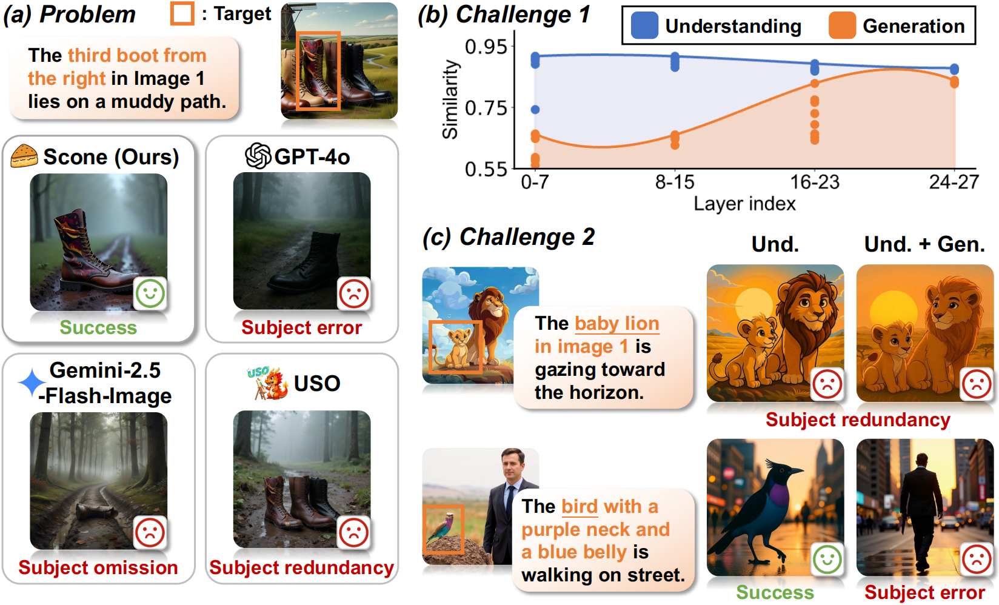
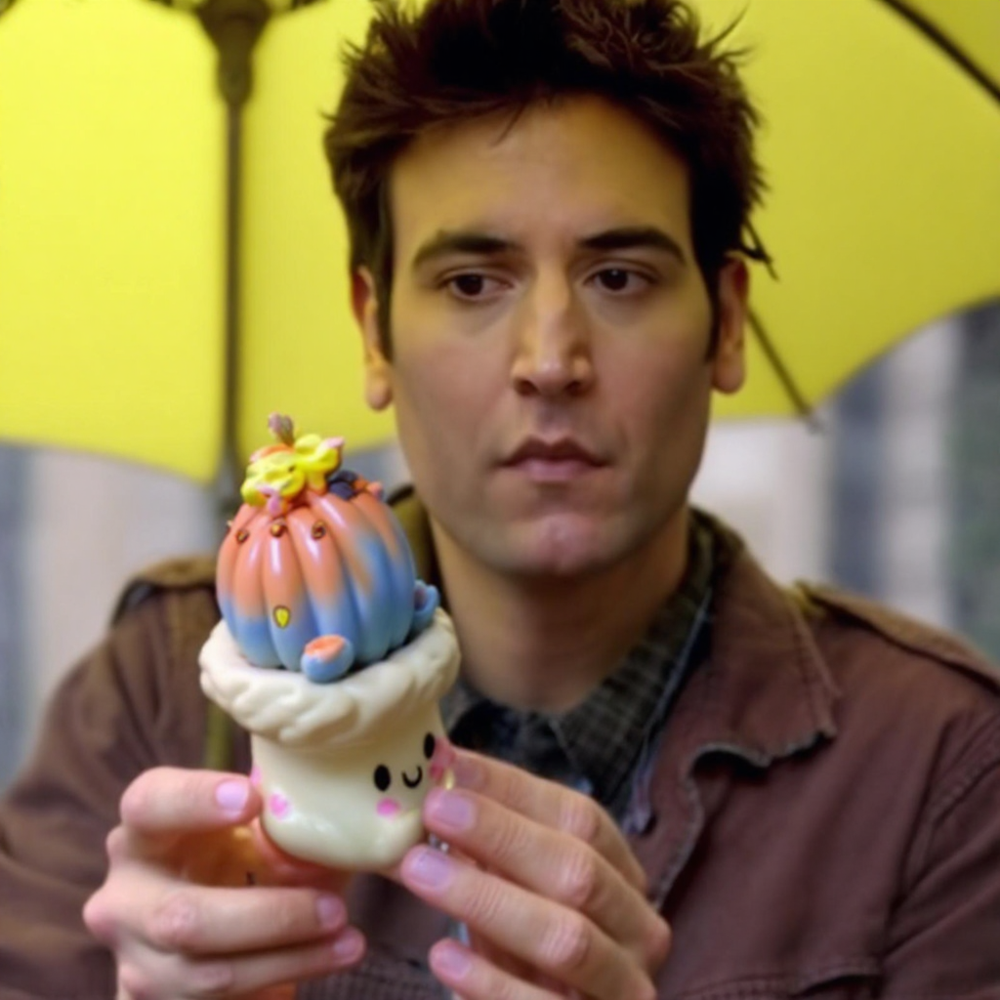
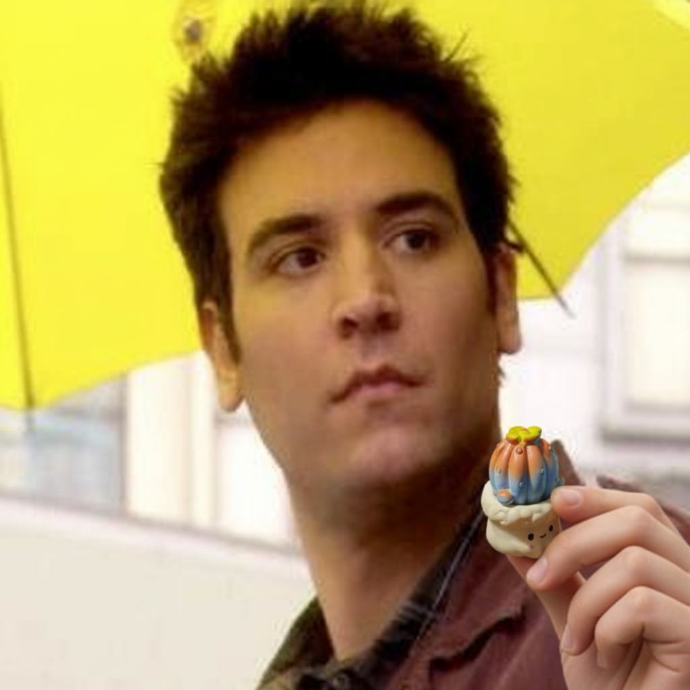
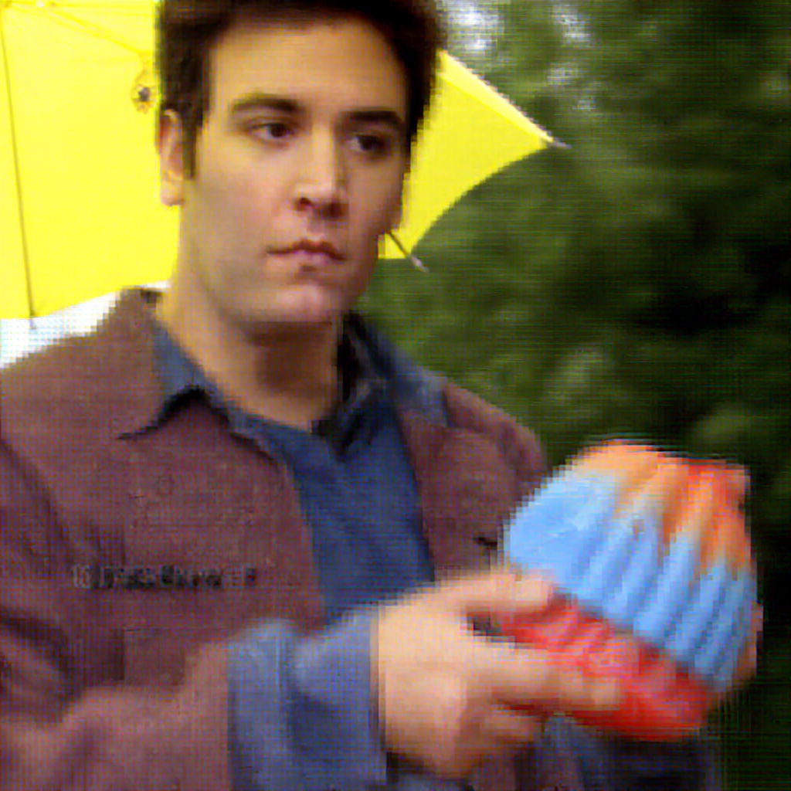
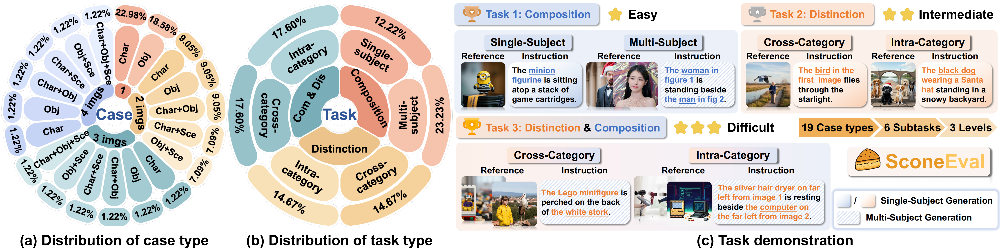

<p align="center">
  
</p>
<h3 align="center">
    Scone: Bridging Composition and Distinction in Subject-Driven Image Generation </br>via Unified Understanding-Generation Modeling
</h3>

<p align="center"> 
  <a href="https://arxiv.org/abs/2512.12675"></a>
  <a href="https://github.com/Ryann-Ran/Scone"></a> 
  <a href="https://huggingface.co/Ryann829/Scone"></a>
  <a href="https://huggingface.co/datasets/Ryann829/Scone-S2I-57K"></a>
  <a href="https://huggingface.co/datasets/Ryann829/SconeEval"></a>
</p>

><p align="center">
>  <span style="color:#137cf3; font-family: Gill Sans;">
>    Yuran Wang<sup>1,2</sup><strong>*</strong> Bohan Zeng<sup>1,2</sup><strong>*</strong>	Chengzhuo Tong<sup>1,2</sup>	Wenxuan Liu<sup>1</sup>	Yang Shi<sup>1,2</sup><br>Xiaochen Ma<sup>1</sup>	Hao Liang<sup>1</sup>	Yuanxing Zhang<sup>2</sup>	Wentao Zhang<sup>1</sup><strong>†</strong>
>  </span>
>  <br>
>  <span><sup>1</sup>Peking University		<sup>2</sup>Kling Team, Kuaishou Technology</span>
>  <br>
>  <span><strong>*</strong> Equal contribution, <strong>†</strong> Corresponding author</span>
></p>

# 📢 News


- 2025.12.16: The [paper](https://arxiv.org/abs/2512.12675), [training code](https://github.com/Ryann-Ran/Scone?tab=readme-ov-file#-train), [inference and evaluation code](https://github.com/Ryann-Ran/Scone?tab=readme-ov-file#-inference-and-evaluation), [model weight](https://huggingface.co/Ryann829/Scone), [training data](https://huggingface.co/datasets/Ryann829/Scone-S2I-57K), [SconeEval benchmark](https://huggingface.co/datasets/Ryann829/SconeEval) are now released.

# 📖 Introduction

Subject-driven image generation has recently gained significant attention, with the focus evolving from single-subject to multi-subject generation, incorporating more input images. Existing methods can process two or more input images and combine subjects based on instructions, showcasing potential for more complex composition tasks.

However, existing works primarily focus on expanding subject combinations while neglecting the ability to distinguish target subjects in complex contexts. As shown in Figure 1.(a), although current models can combine multiple subjects, they may fail to identify and generate the correct target subject when a reference image contains multiple candidates, leading to problems such as subject omissions (none of the candidate subjects appear) or errors (misidentification of the target subject).
Real-world images often involve interference and intricate details, which further limit practical performance.
Thus, we emphasize examining the input subjects themselves, focusing on the model’s ability to ***distinguish the target subject within complex contexts and leverage this information for generation***.

<figure style="text-align: center; border: none; margin: auto;">
    
    <figcaption><b>Figure 1. The distinction problem and challenges.</b></figcaption>
</figure>

* We propose the **Scone** (**S**ubject-driven **co**mposition and distinctio**n** **e**nhancement) model, which supports multi-subject composition and excels in subject distinction in complex contexts. Experiments show our Scone ranks first among open-source models on OmniContext benchmark.
*  We introduce the **understanding bridge strategy**, which transforms the understanding expert into a semantic bridge, enabling early multimodal alignment and attention-based semantic filtering to guide the generation expert, enhancing subject distinction and semantic fidelity without adding extra parameters.
* We develop **SconeEval**, a challenging benchmark with three difficulty levels, to evaluate performance on subject-driven image generation tasks from both composition and distinction perspectives.

# 🔧 Environment setup

```bash
git clone https://github.com/Ryann-Ran/Scone.git
cd Scone
conda create -n scone python=3.10 -y
conda activate scone
pip install -r requirements.txt
pip install flash_attn==2.5.8 --no-build-isolation
```

# 🔥 Train

## Data and base model preparation

1. Download our **22K refined single-candidate data** and **35K multi-candidate data** from [Scone-S2I-57K](https://huggingface.co/datasets/Ryann829/Scone-S2I-57K). The 70K base single-canididate data are sampled from open-source datasets like [X2I](https://huggingface.co/datasets/yzwang/X2I-subject-driven), [MUSAR-Gen](https://huggingface.co/datasets/guozinan/MUSAR-Gen), [UNO-1M](https://huggingface.co/datasets/bytedance-research/UNO-1M), and [Echo-4o-Image](https://huggingface.co/datasets/Yejy53/Echo-4o-Image). Please refer to the dataset links for more details.

   ```bash
   cd Scone
   # pip install -U huggingface_hub
   hf download Ryann829/Scone-S2I-57K --repo-type=dataset --local-dir ./datasets/Scone-S2I-57K
   ```

2. Organize the data hierarchy as follows:

```
Scone-S2I-57K
		├── parquet_data
    │   ├── scone_single_candidate_base/
    │   ├── scone_single_candidate_refined/
    │   └── scone_multi_candidate/
    └── parquet_info
    		├── scone_single_candidate_base.json
        ├── scone_single_candidate_refined.json
        └── scone_multi_candidate.json
```

3. Replace each `your_data_path` placeholder with your **actual absolute path** in:

   * Parquet information files: `./datasets/Scone-S2I-57K/parquet_info/*.json`

   * Dataset information file: `./data/dataset_info.py`

4. Download the checkpoint of our base model [BAGEL](https://github.com/ByteDance-Seed/Bagel) from [HuggingFace](https://huggingface.co/ByteDance-Seed/BAGEL-7B-MoT):

```bash
cd Scone
# pip install -U huggingface_hub
hf download ByteDance-Seed/BAGEL-7B-MoT  --local-dir ./ckpts/BAGEL-7B-MoT
```

> - **Note**: To avoid out-of-memory (OOM) issues, we disable the EMA update strategy originally used in BAGEL. All our training processes are conducted on 8 Nvidia A800 GPUs.
> - The usage of semantic mask in the understanding bridge strategy is controlled by the training argument `--use_semantic_mask`.

## Stage I: Composition training

For Step 1, please use base single-candidate data for 1 epoch (~30 hours): 

```bash
bash scripts/train_stage1_step1.sh  # 🔥 Und., Gen.
```

For Step 2, please use refined single-candidate data for 1 epoch (~15 hours) and replace `model_path` in the script with your Step 1 checkpoint :

```bash
bash scripts/train_stage1_step2.sh  # 🔥 Und., Gen.
```

## Stage II: Distinction training with understanding bridge strategy
For Step 1, please use refined sinlgle-candidate data and multi-candidate data for 1k steps (~5 hours) and replace `model_path`  in the script with your Stage 1 Step 2 checkpoint:

```bash
bash scripts/train_stage2_step1.sh  # 🔥 Und. ❄️ Gen.
```

For Step 2, please use refined sinlgle-candidate data and multi-candidate data for 1k steps (~5 hours) and replace `model_path`  in the script with your Stage 2 Step 1 checkpoint:

```bash
bash scripts/train_stage2_step2.sh  # 🔥 Und., Gen.
```

# 🔍 Inference and Evaluation

## Scone model preparation

Download the Scone model checkpoint from [HuggingFace](https://huggingface.co/Ryann829/Scone):

```bash
# pip install -U huggingface_hub
hf download Ryann829/Scone  --local-dir ./ckpts/Scone
```

## Single case inference

Run the inference script:

```bash
bash scripts/inference_single_case.sh
```

**Example Output:** (Images sampled at 1024x1024 resolution with seed 1234, except for GPT-4o and Gemini-2.5-Flash-Image APIs)

<table>
  <tr>
    <th style="width: 150px; text-align: center;">Ref. 1</th>
    <th style="width: 150px; text-align: center;">Ref. 2</th>
    <th style="width: 200px; text-align: center;">Instruction</th>
    <th style="width: 150px; text-align: center;">Scone (Ours)</th>
    <th style="width: 150px; text-align: center;">GPT-4o</th>
    <th style="width: 150px; text-align: center;">Gemini-2.5-Flash-Image</th>
    <th style="width: 150px; text-align: center;">UNO</th>
    <th style="width: 150px; text-align: center;">Qwen-Image-Edit-2509</th>
    <th style="width: 150px; text-align: center;">BAGEL</th>
    <th style="width: 150px; text-align: center;">OmniGen2</th>
    <th style="width: 150px; text-align: center;">Echo-4o</th>
  </tr>
  <tr>
    <td style="width: 150px; text-align: center;"></td>
    <td style="width: 150px; text-align: center;"></td>
    <td style="width: 200px; text-align: center;">The man from image 2 holds the object which has a blue-and-red top in image 1 in a coffee shop.</td>
    <td style="width: 150px; text-align: center;"></td>
    <td style="width: 150px; text-align: center;"></td>
    <td style="width: 150px; text-align: center;"></td>
    <td style="width: 150px; text-align: center;"></td>
    <td style="width: 150px; text-align: center;"></td>
    <td style="width: 150px; text-align: center;"></td>
    <td style="width: 150px; text-align: center;"></td>
    <td style="width: 150px; text-align: center;"></td>
  </tr>
</table>

## OmniContext benchmark

### Inference

We support inference and evaluation on both the OmniContext and our SconeEval benchmarks, building upon the [OmniContext](https://github.com/VectorSpaceLab/OmniGen2) repository. 

We provide the jsonl version of [OmniContext data](https://huggingface.co/datasets/OmniGen2/OmniContext) in <a href="https://huggingface.co/datasets/Ryann829/OmniContext-jsonl"></a>.

Download the data:

```bash
# pip install -U huggingface_hub
hf download Ryann829/OmniContext-jsonl --repo-type=dataset --local-dir ../OmniContext-jsonl
```

Run the inference script:

```bash
bash scripts/inference_omnicontext.sh
```

### Evaluation

Use GPT-4.1 to evaluate the quality of the generated images and calculate the final score. Please ensure your API key is configured before running the script. 

```bash
bash eval/s2i/omnicontext/eval.sh
```

## ✨ SconeEval benchmark

<p align="center">
  
</p>

To evaluate a model’s ability to distinguish and generate the referred subject in complex visual contexts, we introduce a new benchmark, **SconeEval**. It contains 409 test cases across character, object, and scene combinations and subject distinction, with 19 case types in Figure 2(a) and 6 subtasks in Figure 2(b), providing a comprehensive evaluation of a model’s ability to distinguish and utilize subject features.

Unlike traditional benchmarks that emphasize visual fidelity or text alignment, SconeEval focuses on cross-modal reasoning from complex contexts involving reference images and instructions, which requires deciding *whom* to generate when multiple candidates appear within or across images. 

SconeEval includes three progressively challenging tasks, as shown in Figure 2(c): composition, distinction, and distinction & composition. In the composition task, each reference image contains a subject, and one or more images correspond to single or multiple generated subjects. In the distinction task, each reference image contains multiple subjects, and the model generates one target subject. The distinction & composition task integrates both settings, where each reference image contains multiple subjects and multiple images are used for multi-subject generation. Tasks involving distinction include cross-category and intra-category cases, indicating whether candidate subjects in a reference image belong to the same category. 


<figure style="text-align: center; border: none; margin: auto;">
	
    <figcaption><b>Figure 2. Overview of our SconeEval benchmark.</b></figcaption>
</figure>

### 📊 LeaderBoard

<table border="1" style="border-collapse: collapse; width: 100%;">
    <thead>
        <tr>
            <th rowspan="3">Method</th>
            <th colspan="2">Composition ↑</th>
            <th colspan="4">Distinction ↑</th>
            <th colspan="4">Distinction & Composition ↑</th>
            <th colspan="3">Average ↑</th>
        </tr>
        <tr>
            <th>Single</th>
            <th>Multi</th>
            <th colspan="2">Cross</th>
            <th colspan="2">Intra</th>
            <th colspan="2">Cross</th>
            <th colspan="2">Intra</th>
            <th rowspan="2">COM</th>
            <th rowspan="2">DIS</th>
            <th rowspan="2">Overall</th>
        </tr>
        <tr>
            <th>COM</th>
            <th>COM</th>
            <th>COM</th>
            <th>DIS</th>
            <th>COM</th>
            <th>DIS</th>
            <th>COM</th>
            <th>DIS</th>
            <th>COM</th>
            <th>DIS</th>
        </tr>
    </thead>
    <tbody>
        <tr>
            <td colspan="14" style="background-color: #ffefe6; text-align: center; font-weight: bold; font-style: italic;">Closed-Source Model</td>
        </tr>
        <tr>
            <td>Gemini-2.5-Flash-Image</td>
            <td>8.87</td>
            <td>7.94</td>
            <td>9.12</td>
            <td><strong>9.15</strong></td>
            <td>9.00</td>
            <td>8.50</td>
            <td>8.27</td>
            <td><strong>8.87</strong></td>
            <td>8.17</td>
            <td>8.85</td>
            <td>8.56</td>
            <td>8.84</td>
            <td>8.70</td>
        </tr>
        <tr>
            <td>GPT-4o<sup>*</sup></td>
            <td><strong>8.92</strong></td>
            <td><strong>8.51</strong></td>
            <td><strong>9.18</strong></td>
            <td>8.55</td>
            <td><strong>9.45</strong></td>
            <td><strong>9.01</strong></td>
            <td><strong>8.83</strong></td>
            <td>8.49</td>
            <td><strong>8.99</strong></td>
            <td><strong>9.56</strong></td>
            <td><strong>8.98</strong></td>
            <td><strong>8.90</strong></td>
            <td><strong>8.94</strong></td>
        </tr>
        <tr>
            <td colspan="14" style="background-color: #e0eef9; text-align: center; font-weight: bold; font-style: italic;">Generation Model</td>
        </tr>
        <tr>
            <td>FLUX.1 Kontext [dev]</td>
            <td>7.92</td>
            <td>-</td>
            <td>7.93</td>
            <td>8.45</td>
            <td>6.20</td>
            <td>6.11</td>
            <td>-</td>
            <td>-</td>
            <td>-</td>
            <td>-</td>
            <td>-</td>
            <td>-</td>
            <td>-</td>
        </tr>
        <tr>
            <td>USO</td>
            <td>8.03</td>
            <td>5.19</td>
            <td>7.96</td>
            <td>8.50</td>
            <td>7.14</td>
            <td>6.51</td>
            <td>5.10</td>
            <td>6.25</td>
            <td>5.07</td>
            <td>5.57</td>
            <td>6.41</td>
            <td>6.71</td>
            <td>6.56</td>
        </tr>
        <tr>
            <td>UNO</td>
            <td>7.53</td>
            <td>5.38</td>
            <td>7.27</td>
            <td>7.90</td>
            <td>6.76</td>
            <td>6.53</td>
            <td>5.27</td>
            <td>7.02</td>
            <td>5.61</td>
            <td>6.27</td>
            <td>6.31</td>
            <td>6.93</td>
            <td>6.62</td>
        </tr>
        <tr>
            <td>UniWorld-V2<br>(Edit-R1-Qwen-Image-Edit-2509)</td>
            <td>8.41</td>
            <td><strong>7.16</strong></td>
            <td>8.63</td>
            <td>8.24</td>
            <td><strong>7.44</strong></td>
            <td>6.77</td>
            <td>7.52</td>
            <td>8.03</td>
            <td><strong>7.70</strong></td>
            <td><strong>7.24</strong></td>
            <td><strong>7.81</strong></td>
            <td>7.57</td>
            <td>7.69</td>
        </tr>
        <tr>
            <td>Qwen-Image-Edit-2509</td>
            <td><strong>8.54</strong></td>
            <td>6.85</td>
            <td><strong>8.85</strong></td>
            <td><strong>8.57</strong></td>
            <td>7.32</td>
            <td><strong>6.86</strong></td>
            <td><strong>7.53</strong></td>
            <td><strong>8.13</strong></td>
            <td>7.49</td>
            <td>7.02</td>
            <td>7.76</td>
            <td><strong>7.65</strong></td>
            <td><strong>7.70</strong></td>
        </tr>
        <tr>
            <td colspan="14" style="background-color: #E6E6FA; text-align: center; font-weight: bold; font-style: italic;">Unified Model</td>
        </tr>
        <tr>
            <td>BAGEL</td>
            <td>7.14</td>
            <td>5.55</td>
            <td>7.49</td>
            <td>7.95</td>
            <td>6.93</td>
            <td>6.21</td>
            <td>6.44</td>
            <td>7.38</td>
            <td>6.87</td>
            <td>7.27</td>
            <td>6.74</td>
            <td>7.20</td>
            <td>6.97</td>
        </tr>
        <tr>
            <td>OmniGen2</td>
            <td>8.00</td>
            <td>6.59</td>
            <td>8.31</td>
            <td>8.99</td>
            <td>6.99</td>
            <td>6.80</td>
            <td>7.28</td>
            <td>8.30</td>
            <td>7.14</td>
            <td>7.13</td>
            <td>7.39</td>
            <td>7.81</td>
            <td>7.60</td>
        </tr>
        <tr>
            <td>Echo-4o</td>
            <td><strong>8.58</strong></td>
            <td><strong>7.73</strong></td>
            <td>8.36</td>
            <td>8.33</td>
            <td>7.74</td>
            <td>7.18</td>
            <td>7.87</td>
            <td>8.72</td>
            <td>8.01</td>
            <td>8.33</td>
            <td>8.05</td>
            <td>8.14</td>
            <td>8.09</td>
        </tr>
        <tr>
            <td><strong>Scone (Ours)</strong></td>
            <td>8.52</td>
            <td>7.40</td>
            <td><strong>8.98</strong></td>
            <td><strong>9.73</strong></td>
            <td><strong>7.97</strong></td>
            <td><strong>7.74</strong></td>
            <td><strong>8.20</strong></td>
            <td><strong>9.25</strong></td>
            <td><strong>8.21</strong></td>
            <td><strong>8.44</strong></td>
            <td><strong>8.21</strong></td>
            <td><strong>8.79</strong></td>
            <td><strong>8.50</strong></td>
        </tr>
    </tbody>
</table>

> - *: GPT-4o responded to 365~370 test cases out of the total 409 cases due to OpenAI safety restrictions.
> - To mitigate randomness, we perform 3 rounds of sampling at 1024x1024 resolution, scoring 3 times per round, yielding 9 group results. The final score is the average of these results.

### Inference

Download the data:

```bash
# pip install -U huggingface_hub
hf download Ryann829/SconeEval --repo-type=dataset --local-dir ../SconeEval
```

Run the script:

```bash
bash scripts/inference_sconeeval.sh
```

### Evaluation

Use GPT-4.1 to evaluate the quality of the generated images and calculate the final score. Please ensure your API key is configured before running the script.

```bash
bash eval/s2i/sconeeval/eval.sh
```

# 🚀 Updates

- [x] Release paper
- [x] Release training code
- [x] Release inference and evaluation code
- [x] Release model weight
- [x] Release training data
- [x] Release SconeEval benchmark


# 🚰 Citation
If you find Scone helpful, please consider giving the repo a star ⭐.

If you find this project useful for your research, please consider citing our paper:
```bibtex
@misc{wang2025sconebridgingcompositiondistinction,
      title={Scone: Bridging Composition and Distinction in Subject-Driven Image Generation via Unified Understanding-Generation Modeling}, 
      author={Yuran Wang and Bohan Zeng and Chengzhuo Tong and Wenxuan Liu and Yang Shi and Xiaochen Ma and Hao Liang and Yuanxing Zhang and Wentao Zhang},
      year={2025},
      eprint={2512.12675},
      archivePrefix={arXiv},
      primaryClass={cs.CV},
      url={https://arxiv.org/abs/2512.12675}, 
}
```

# 💪 Acknowledgements

This project builds upon the following repositories:

* [BAGEL](https://github.com/ByteDance-Seed/Bagel)
* [OmniContext](https://github.com/VectorSpaceLab/OmniGen2)

Special thanks to these original projects and open-source datasets for their valuable contributions.

